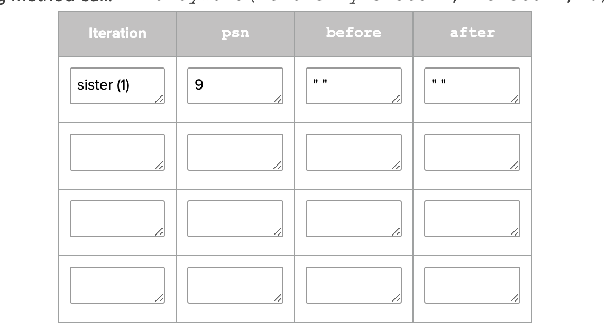
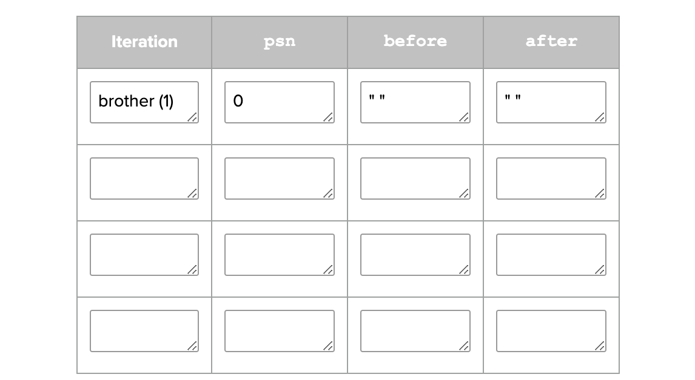
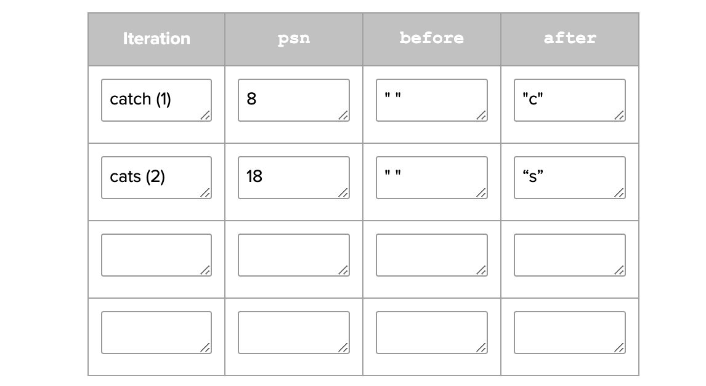
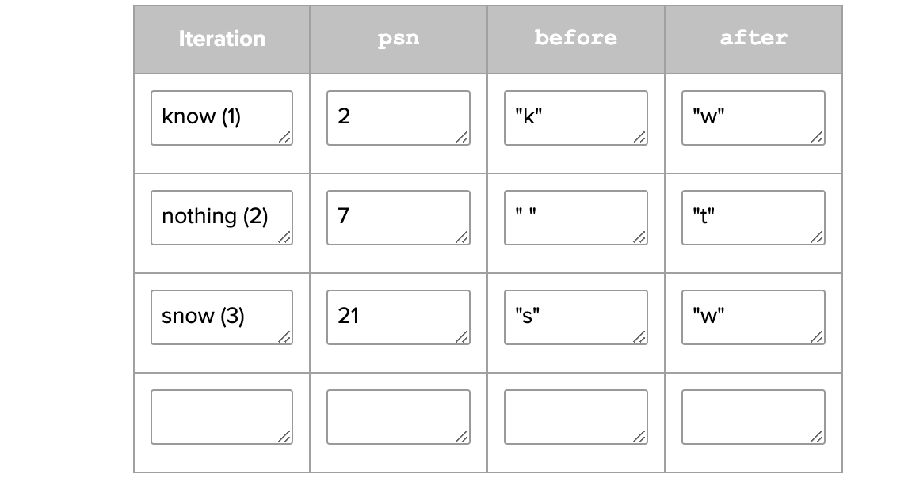

<h1> 1.1.3 </h1>

#8  You could do song.setFavorite(true). My preferred version of mutator for favorite is new Song  

Conclusion #1: You may need more than one constructor for a class if you need different amounts of parameters in each constructor. For example there are two parameters in public Song(String title, double price) and three parameters in public Song(String title, double price, int rating). 

<h1> 1.1.4 </h1>  

#1a. Strings are literally objects of the String class, that happen to hold sequences of characters. Also, all class name begin with a capital letter, like in String, and primitive types start with lowercase letter (int). 

#1b. A reference with no value  

#1c. String test; test = "This is a test message."; or String test = "This is a test message.";

#1d. A class created from another class that is called a superclass. A subclass inherits or receives all funcitonality from its superclass. 

#1e. The superclass of the String class is the Object class. 

#1f. You can call .getClass() for class and .getSuperclass() for superclass. 

#10 result1 uses == and result2 uses .equals(). "==" compares the reference identity. .equals() method compares only contents.

Conclusion #1: first way --> if(str.length() != 0 && str.length() <= 80) second way --> if(!(str.length == 0 && str.length() >= 80)

Conclusion #2: else if(!(cold && windy))
                      {   
                        return "Enjoy the hike!";
                      } 

<h1> 1.1.5 </h1>

 #1: I would write Math.sqrt(25) 

  #2: Algorithm 2 generates a better random dice roll because there are two random number generators, it rolls one dice with six sides twice. On the other hand, Algorithm 1 rolls only one dice with eleven sides between 2 and 12 . 

 Conclusion #1: The algorithm specified this length because it needs the random number generator to choose a value that is in the String's length. That pattern for that specific random number generator chooses a random number to begin the string at, and then prints the rest of the string.

 Conclusion #2: r1 always returns 1 because the Math.random() always generates 0, and (0 * 10) + 1 = 1. 
                   On the other hand, r2 actually returns a random number 1 - 10. The r2 random number generator correctly multiplies Math.random() * 10.  

<h1> 1.1.6 </h1>
 
#1a: The chatbots were coded nicely in respect to the character it "speaks" for. For example, the robot chatbot gives robotic sounding answers. 

#1b: The chatbot picks up on keywords that relate to family, school, sports, etc. 

 
#1c: For example, I entered "My brother is one grade above me." The chatbot responded with, "So you are not an only child.
 Please tell me more about your family." 

 
#2b. The chatbot responds to "My mother and I talked last night" & "Do you know my brother?" with "Tell me more about your family." Next, it responds to "I said no!" with "Why so negative?". Finally, it responds to "The weather is nice." with a random response. 

 
#2d. The keyword "food" insinuates the response "I want some food". The keyword "cat" insinuates the response "Tell me more about your pets."

 
#2e. When a sentence has  more than one keyword, it will respond to the first keyboard that corresponds in the actual code. In the case of “My mother has a daughter but no cat periods”. It answers to the "no" keyword because that is the first else if statement in my program.

 
#2f. When keywords are included in the two strings “I know all the state capitals” and “I like vegetables smothered in cheese”. The program isn't able to know that the keyword is contained within a word, and gives a response that doesn't fit the
 entered statement. 

 
#3d. Iteration: sister (1)  

 
#3e. Iteration: brother (1)  

 
#3f. Iteration: catch (1), cats (2)  

 
#3g. Iteration: know (1), nothing (2), snow (3)  

#4d. I improved the algorithim by adding two more methods that give a response to the inputs "I want ... " and "I ... you ". I also added to the getResponse method to search for certain keywords. Now the chatbot can respond to more statements. 

#13a.A chatbat can definitly be a cyberbully if it is harassing and sending hurtful messages to people.

#13b.If an AI entity offends someone I don't think it is the AI or programmers fault. The AI uses words other people have written to respond to messages. The AI learns from what others say.

#13c. If I knew I was getting bullied by an AI entity it wouldn't be a big deal. The AI didn't actually come up with the hateful statements, it uses other people's words.

#13d. If it was possible to create a non-offensive chatbot, it would be very difficult. Especially because everyone finds different things offensive. It would be extremely hard to please everyone. 

Conclusion Q: A chatbot could differentiate between the different strings that each contain a certain keyword somewhere in the statement by tracing the method call. In the getResponse method in Magpie.java the method uses the position of the keyword to decide if the keyword was used in the correct instance. For example, it would know that "I like your post" was different than "fencepost" because of the positioning of the keyword. It knows that post in "fencepost" has a letter in front of it, meaning it isn't actually referring to an instagram post for example.

